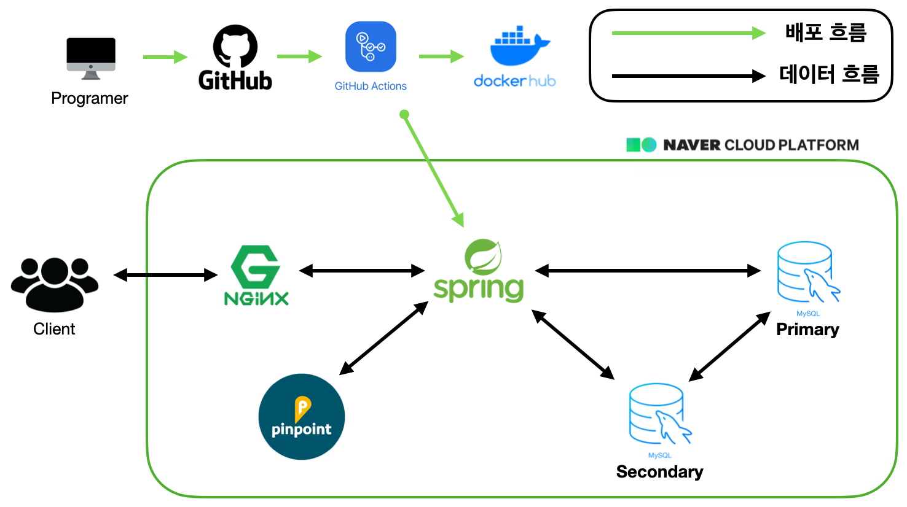
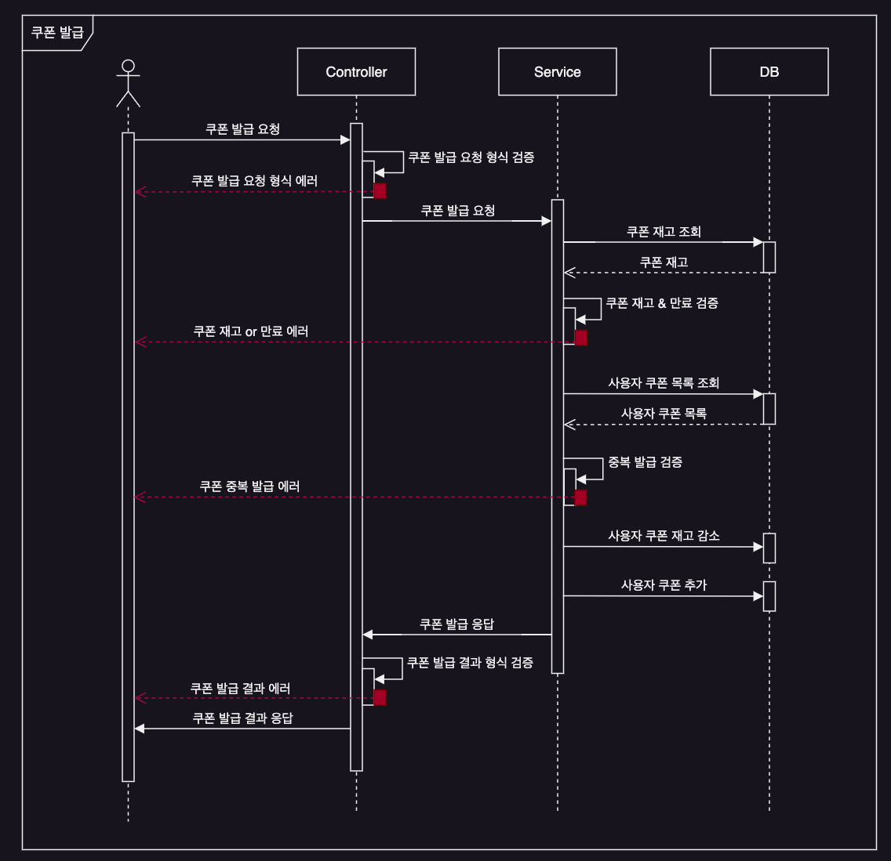
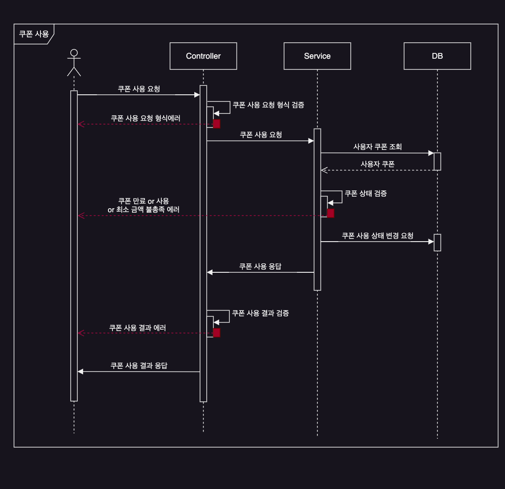

# Anywhere You Use Coupon Service

오늘의 집, 여기어때, 배달의 민족과 같은 할인 기능이 필요한 모든 서비스에서 쉽게 사용할 있는 할인 쿠폰 플랫폼을 위한 프로젝트입니다. 본 프로젝트의 할인 쿠폰 플랫폼을 사용하여, 판매 서비스는 손쉽게 쿠폰을 발행하고, 쿠폰을 적용한 상품의 가격을 응답받을 수 있습니다.

한정된 쿠폰이 나오면 많은 고객이 쿠폰을 받기 위해 몰려들 때 발생할 수 있는 문제를 고려하고, 다량의 트래픽을 효율적으로 처리하는 서버를 만드는 것이 본 프로젝트의 첫 번째 목표입니다.

```
본 프로젝트는 쿠폰 발행/사용에 대한 서비스에 집중하여 개발할 예정이며, 그에 따라 사용자 인가/인증 및 쿠폰 생성과 관련된 컴포넌트는 추후 개발 예정입니다.
```

## 🏆프로젝트의 목적

- 객체를 지향하여 재사용성 및 유지보수에 용이한 코드 작성
- 요구사항을 충족하면서 문제를 발견 및 정의하고, 트레이드-오프를 고려하여 문제를 해결
- 다량의 트래픽으로 인한 수많은 트랜잭션에서의 데이터의 정확성과 일관성을 보장
- 성능 테스트를 통한 성능 개선

## ⚒️사용 기술 스택
- Java 17
- Spring Boot
- JUint5
- MySQL
- JPA

## 프로젝트 구조



## 유스케이스 시퀀스 다이어그램

### 쿠폰 발급 요청 시퀀스 다이어그램



### 쿠폰 사용 요청 시퀀스 다이어그램



## 부하 및 성능 테스트 툴

- 부하 테스트 : nGrinder 
- 성능 테스트 : pinpoint

## Technical Issue

- [동시성 이슈 : 데드락 발생 원인](https://cire0304.github.io/ayu-coupon/title-%ED%86%A0%EC%9D%B4-%ED%94%84%EB%A1%9C%EC%A0%9D%ED%8A%B8-%EB%8F%99%EC%8B%9C%EC%84%B1-%EC%9D%B4%EC%8A%88-%EB%8D%B0%EB%93%9C%EB%9D%BD-%EB%B0%9C%EC%83%9D-%EC%9B%90%EC%9D%B8/)
- [동시성 이슈 : 이슈 해결을 위한 lock 선택](https://cire0304.github.io/ayu-coupon/title-%ED%86%A0%EC%9D%B4-%ED%94%84%EB%A1%9C%EC%A0%9D%ED%8A%B8-%EB%8F%99%EC%8B%9C%EC%84%B1-%ED%95%B4%EA%B2%B0%EC%9D%84-%EC%9C%84%ED%95%9C-lock-%EC%84%A0%ED%83%9D/)
- [초기 응답 지연 이슈 : warm up](https://cire0304.github.io/ayu-coupon/title-%ED%86%A0%EC%9D%B4-%ED%94%84%EB%A1%9C%EC%A0%9D%ED%8A%B8-%EC%B4%88%EA%B8%B0-%EC%9D%91%EB%8B%B5-%EC%A7%80%EC%97%B0-%EC%9D%B4%EC%8A%88-%ED%95%B4%EA%B2%B0-warm-up/)
- [응답 지연 이슈 : connection-pool-size, index (TPS : 61.2 -> 179.3)](https://cire0304.github.io/ayu-coupon/title-%ED%86%A0%EC%9D%B4-%ED%94%84%EB%A1%9C%EC%A0%9D%ED%8A%B8-%EC%9D%91%EB%8B%B5-%EC%A7%80%EC%97%B0-%EC%9D%B4%EC%8A%88-%EC%9D%B8%EB%8D%B1%EC%8A%A4/)
- [Lock으로 인한 응답 지연 이슈 : Lock 경합 최소화 (TPS : 180.7 -> 220.3)](https://cire0304.github.io/ayu-coupon/title-%ED%86%A0%EC%9D%B4-%ED%94%84%EB%A1%9C%EC%A0%9D%ED%8A%B8-Lock%EC%9C%BC%EB%A1%9C-%EC%9D%B8%ED%95%9C-%EC%9D%91%EB%8B%B5-%EC%A7%80%EC%97%B0-%EC%9D%B4%EC%8A%88-%EB%A1%9C%EC%A7%81-%EA%B0%9C%EC%84%A0/)
- [데이터소스 라우팅 이슈 : 어노테이션 기반 데이터소스 라우팅 어노테이션](https://cire0304.github.io/ayu-coupon/title-%ED%86%A0%EC%9D%B4-%ED%94%84%EB%A1%9C%EC%A0%9D%ED%8A%B8-%EB%8D%B0%EC%9D%B4%ED%84%B0%EC%86%8C%EC%8A%A4-%EB%9D%BC%EC%9A%B0%ED%8C%85-%EC%9D%B4%EC%8A%88-AOP%EB%A5%BC-%ED%99%9C%EC%9A%A9%ED%95%9C-%EC%BB%A4%EC%8A%A4%ED%85%80-%EB%8D%B0%EC%9D%B4%ED%84%B0%EC%86%8C%EC%8A%A4-%EB%9D%BC%EC%9A%B0%ED%8C%85-%EC%96%B4%EB%85%B8%ED%85%8C%EC%9D%B4%EC%85%98/)

## 📑WIKI

1. [요구 사항](https://github.com/f-lab-edu/coupon-project/wiki/%EC%9A%94%EA%B5%AC-%EC%82%AC%ED%95%AD)
2. [API 명세서](https://github.com/f-lab-edu/coupon-project/wiki/API-%EB%AA%85%EC%84%B8%EC%84%9C-(%EC%9E%84%EC%8B%9C))
3. [유스케이스 시퀀스 다이어그램](https://github.com/f-lab-edu/AYU-Coupon-Service/wiki/%EC%9C%A0%EC%8A%A4%EC%BC%80%EC%9D%B4%EC%8A%A4-%EC%8B%9C%ED%80%80%EC%8A%A4-%EB%8B%A4%EC%9D%B4%EC%96%B4%EA%B7%B8%EB%9E%A8)
4. [어플리케이션 설계](https://github.com/f-lab-edu/AYU-Coupon-Service/wiki/%EC%84%A4%EA%B3%84)

본 프로젝트의 자세한 내용은 [Wiki](https://github.com/f-lab-edu/coupon-api/wiki)에서 확인할 수 있습니다.
